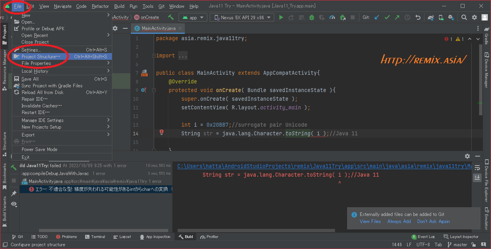
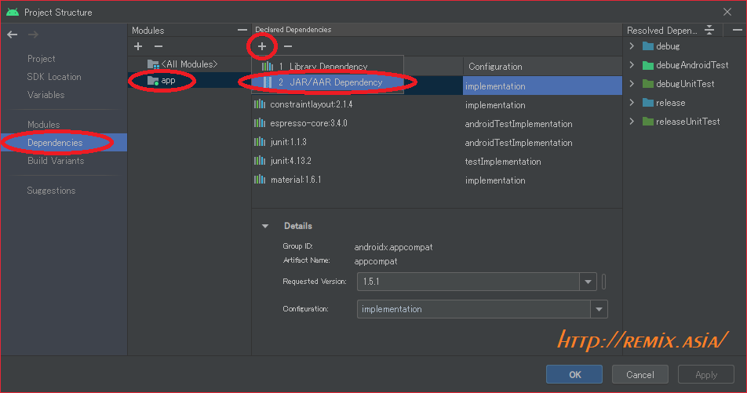
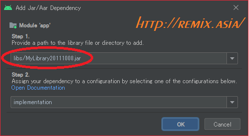
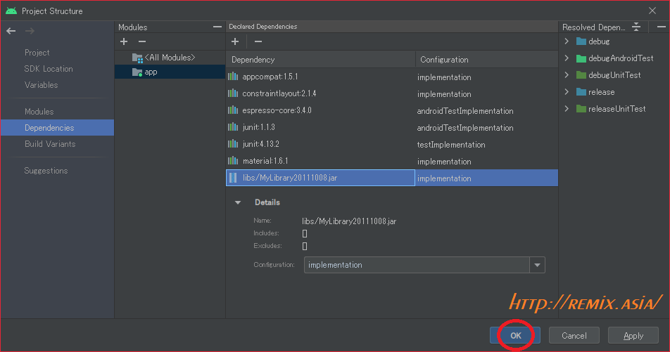
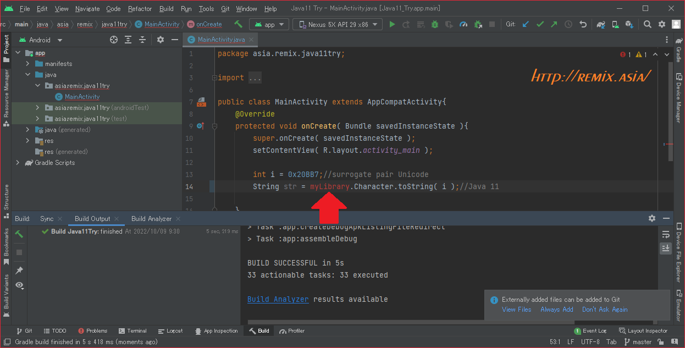

# How to hedge build error "java.lang.Character.toString( int codePoint )" (Since:Java11) by Android Studio.

```java:title
int i = 0x20BB7;//surrogate pair Unicode
String str = java.lang.Character.toString( i );
```
is "error: incompatible types: possible lossy conversion from int to char".

But success compile it
by "C:\Program Files\Android\Android Studio\jre\bin\javac.exe" = Android Studio include openJDK 11.

## Environment
```
Android Studio Dolphin | 2021.3.1
Build #AI-213.7172.25.2113.9014738, built on September 1, 2022
Runtime version: 11.0.13+0-b1751.21-8125866 amd64
VM: OpenJDK 64-Bit Server VM by JetBrains s.r.o.
Windows 11 10.0
GC: G1 Young Generation, G1 Old Generation
Memory: 1280M
Cores: 8
Registry:
    external.system.auto.import.disabled=true
    ide.text.editor.with.preview.show.floating.toolbar=false</pre>
```
```
Android Studio Dolphin | 2021.3.1
Build #AI-213.7172.25.2113.9014738, built on September 1, 2022
Runtime version: 11.0.13+0-b1751.21-8125866 amd64
VM: OpenJDK 64-Bit Server VM by JetBrains s.r.o.
Windows 10 10.0
GC: G1 Young Generation, G1 Old Generation
Memory: 1280M
Cores: 6
Registry:
    external.system.auto.import.disabled=true
    ide.text.editor.with.preview.show.floating.toolbar=false
```
## How to make Original Library(.jar), How to use it.

Android Studio &gt; File &gt; Project Structure

<a target="img" href="./p010.png"></a>

Dependencies &gt; Modules, app &gt; Declare Dependencies, +, JAR/AAR Dependency

<a target="img" href="./p020.png"></a>

Provide a path to the library file or Directory to add &gt; libs/MyLibrary20111008.jar &gt; ok



<a target="img" href="./p040.png"></a>

success.

<a target="img" href="./p050.png"></a>

## Ticket
https://issuetracker.google.com/issues/251742087

## confirmed
Samsung Galaxy S7 edge (Andorid 7.0)

ASUS_X01AD(Android 9)

## article
http://www.remix.asia/blog/remix/2022/10/java11.html